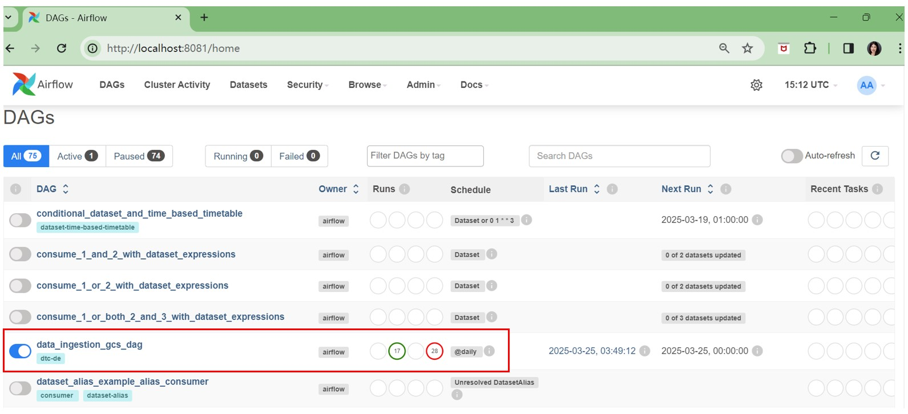
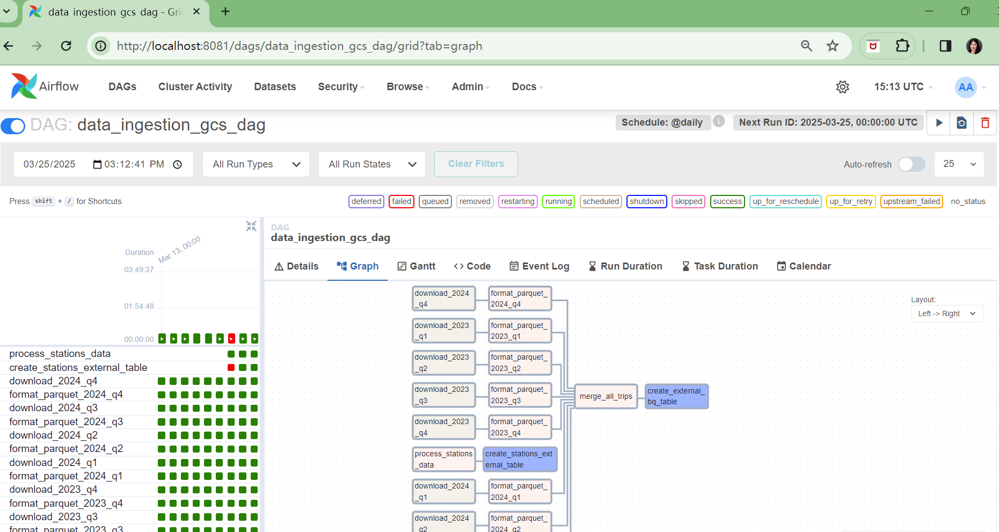
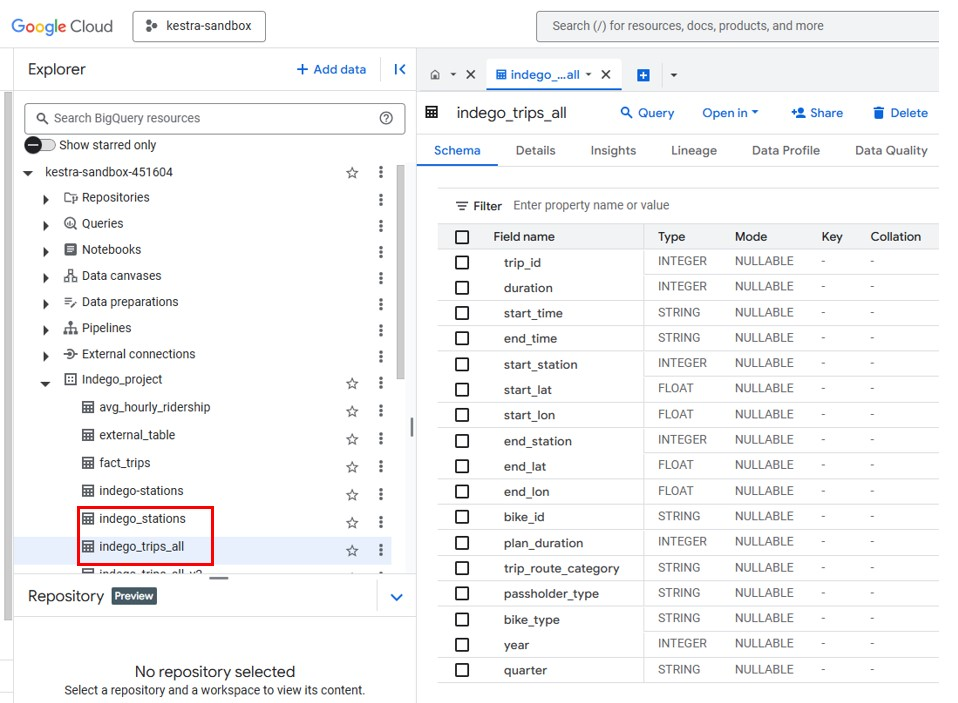

# Step 2: Data Ingestion & Loading

Make sure you have installed:

- Docker
- gcloud CLI
- Python 3.7+

**1. Airflow & Docker Setup:**

Follow the instructions [here](https://github.com/DataTalksClub/data-engineering-zoomcamp/blob/main/cohorts/2022/week_2_data_ingestion/airflow/1_setup_official.md) to set up Airflow and Docker.

- Rename your gcp-service-accounts-credentials file to `google_credentials.json` & store it in your `$HOME` directory.

```
    cd ~ && mkdir -p ~/.google/credentials/
    mv <path/to/your/service-account-authkeys>.json ~/.google/credentials/google_credentials.json
```
- Set the Airflow user

```
mkdir -p ./dags ./logs ./plugins
echo -e "AIRFLOW_UID=$(id -u)" > .env
```
- Create `.env` file
- Set environment variables `GCP_PROJECT_ID`, `GCP_GCS_BUCKET`, `GOOGLE_APPLICATION_CREDENTIALS` & `AIRFLOW_CONN_GOOGLE_CLOUD_DEFAULT` in your [docker-compose.yaml](https://github.com/Anran0716/DE-Project-Bikeshare/blob/main/Airflow/docker-compose.yaml)

**2. Deploy Docker:**

Follow the instructions [here](https://github.com/DataTalksClub/data-engineering-zoomcamp/tree/main/cohorts/2022/week_2_data_ingestion/airflow) to deploy Docker. 

```
docker-compose build
docker-compose up airflow-init
docker-compose up
```

**3. Extract and load the raw data in Google Bigquery:**

Once successfully setting up, Login to Airflow web UI on `localhost:8081` with creds. The page should look like this.



Click the `data_ingestion_gcs_dag` and run the [code](https://github.com/Anran0716/DE-Project-Bikeshare/blob/main/Airflow/dags/data_ingestion_gcs_dag.py).
This code aims to:
- Extract indego trip data (2023-2024) and station data from [here](https://www.rideindego.com/about/data/)
- Merge all the trip data 
- Create external table `indego_trips_all` and `indego_stations`
- Upload both tables to the `Indego_project` dataset in your GCP project



Once successfully running this code, you should be able to see two new external tables, `indego_trips_all` and `indego_stations`, in the `Indego_project` dataset in your GCP project. 

