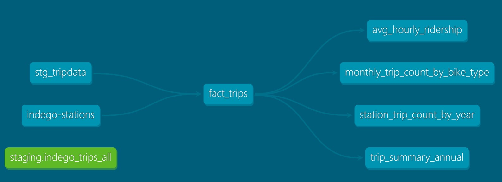
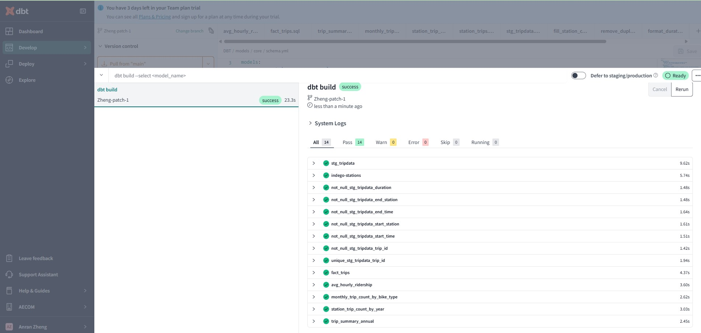
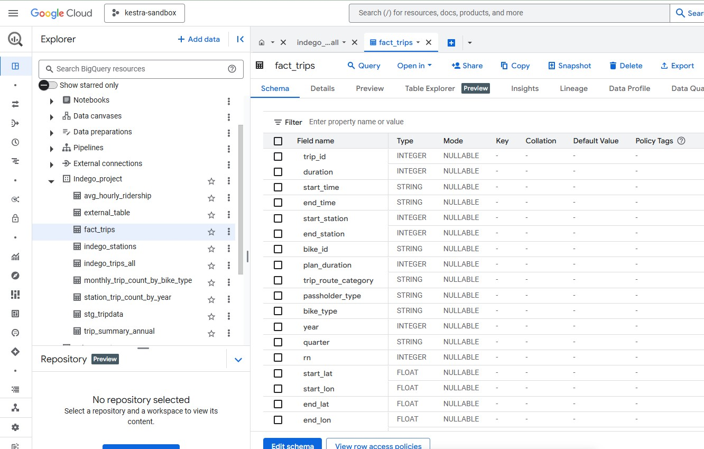

# Step 3: Data Transformation

After transforming and loading the data into BigQuery with Airflow, we use Data Build Tool (DBT) to join the dimension tables with the fact tables. This process generates specific reporting tables in another schema within BigQuery. These reporting tables are optimized for querying and analysis, providing insights into various aspects of the data.

**1.Set up DBT with Bigquery:**

[Instructions](https://github.com/ManuelGuerra1987/data-engineering-zoomcamp-notes/blob/main/4_Analytics-Engineering/README.md)

- Create a BigQuery service account and new key
- Create a dbt cloud project and connect with Github repository [Video source](https://www.youtube.com/watch?v=J0XCDyKiU64)
- Set up the development environment [Video source](https://www.youtube.com/watch?v=V2m5C0n8Gro)

**2.Run the DBT model:**

Here is the lineage graph for DBT. The goal is to transform raw data, `Indego_trips_all` and `indego_stations` into a series of aggregated tables for further dashboard visualization. 

Model overview:
- [stg_tripdata](https://github.com/Anran0716/DE-Project-Bikeshare/blob/main/DBT/models/staging/stg_tripdata.sql): This staging model cleaned raw trip data from `indego_trips_all` table.
- [fact_trips](https://github.com/Anran0716/DE-Project-Bikeshare/blob/main/DBT/models/core/fact_trips.sql): This is a fact table, including a detailed records of trips and bike station information.
- [avg_hourly_ridership](https://github.com/Anran0716/DE-Project-Bikeshare/blob/main/DBT/models/core/avg_hourly_ridership.sql): This model calculates the average number of trips taken at each hour of the day.
- [monthly_trip_count_by_bike_type](https://github.com/Anran0716/DE-Project-Bikeshare/blob/main/DBT/models/core/monthly_trip_count_by_bike_type.sql): This model tracks monthly trends in bike usage based on different bike types.
- [station_trip_count_by_year](https://github.com/Anran0716/DE-Project-Bikeshare/blob/main/DBT/models/core/station_trip_count_by_year.sql): This model calculates the annually number of trips starting and ending at each station. 
- [trip_summary_annual](https://github.com/Anran0716/DE-Project-Bikeshare/blob/main/DBT/models/core/trip_summary_annual.sql): Provides a comprehensive annual summary of bike share usage with key performance metrics.

To run the DBT model: 
- Revise the name of `database` with your project name in [schema.yml](https://github.com/Anran0716/DE-Project-Bikeshare/blob/main/DBT/models/staging/schema.yml) and [stg_tripdata.sql](https://github.com/Anran0716/DE-Project-Bikeshare/blob/main/DBT/models/staging/stg_tripdata.sql)
- Run `dbt build`
- If you want to check single model, using `dbt compile` and `dbt run --select {model_name}`

After successfully running these models, in your Bigquery project, you should see a few table being created. 

