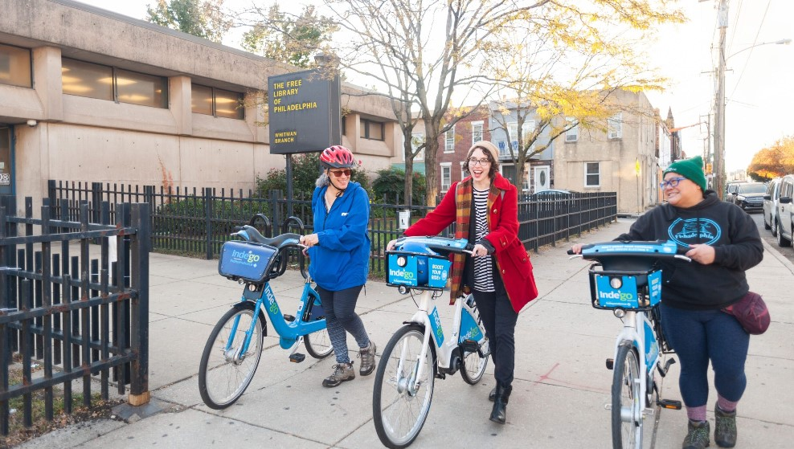
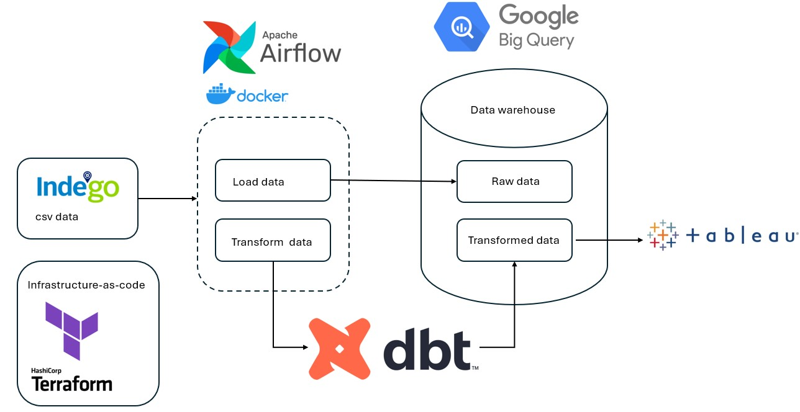
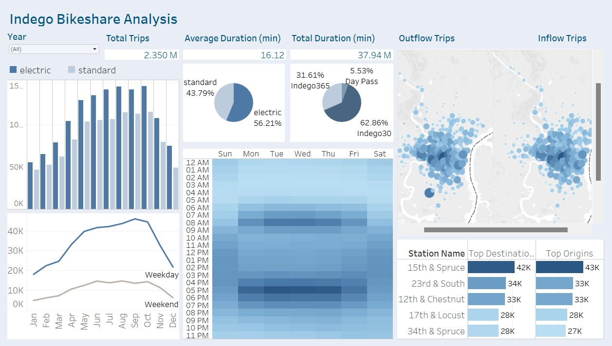

# DE-Project-Bikeshare

## Problem Statement

Philadelphia’s bikeshare system, [Indego](https://www.rideindego.com/), has provided communities across the city access to public bikes for over eight years. The goal of this project is to develop a data pipeline and dashboard, which provides periodic analysis of bikeshare usage patterns and travel demand trends.

## Datasets

-  [Indego bikeshare trip data 2023 - 2024](https://www.rideindego.com/about/data/)
-  [Indego bikeshare station](https://github.com/Anran0716/DE-Project-Bikeshare/blob/main/DBT/seeds/indego-stations.csv)

## Workflow

The ETL pipeline is designed to Extract data from various sources, Transform it using DBT, and Load it into BigQuery for analysis. The process involves the following steps:
- **Extraction:** Docker containerized Airflow orchestrates data extraction from CSV files.
- **Loading:** Extracted data is loaded into BigQuery using Airflow DAGs.
- **Transformation:** DBT performs data cleaning, normalization, and aggregation directly in BigQuery.
- **Visualization:** Transformed data is visualized using Tableau, providing actionable insights into bike share usage.

### Tools & Technology

- **Cloud Provider:** Google Cloud Platform (GCP)
- **Infrastructure as Code:** Terraform
- **Orchestration:** Apache Airflow (Containerized with Docker)
- **Data Processing:** DBT for transformations
- **Storage & Querying:** GCS, BigQuery
- **Visualization:** Tableau

### Dashboard & Visualization

[Dashboard](https://us-east-1.online.tableau.com/t/kellyzheng-402c63b0c7/views/IndegoBikeshareAnalysis/IndegoBikeshareAnalysis)

The dashboard is built with Tableau to show key metrics about Indego ridership pattern, identifying peak demand periods and popular stations. 

**Key Insights:**
- **Bike Usage:** More people tend to choose e-bikes and monthly pass (Indego30). 
- **Temporal Trends:** Ridership peaks during summer months, with the highest activity from May to September. There are more trips at weekdays compared to weekends. Peak riding hours are around 8 AM (morning commute) and 5-6 PM (evening commute).
- **Station Activity:** 15th & Spruce is the most popular origin/destination station. Other popular stations include 23rd & South, 12th & Chestnut, 17th & Locust, and 34th & Spruce. Trip activities concentrated in the central Philadelphia downtown. 

## General Guidance

[**Step 1: Setup**](https://github.com/Anran0716/DE-Project-Bikeshare/tree/main/Terraform)

- Set up GCP environment, Terraform, Docker, and configure necessary IAM roles.

[**Step 2: Data Ingestion & Loading**](https://github.com/Anran0716/DE-Project-Bikeshare/tree/main/Airflow)

- Use Docker to containerize the pipeline. 
- Build Airflow DAGs for workflow automation.
- Load the raw data in Google Bigquery. 

[**Step 3: Data Transformation**](https://github.com/Anran0716/DE-Project-Bikeshare/tree/main/DBT)

- Implement data partitioning and indexing in BigQuery.
- Optimize data transformations using DBT.

[**Step 4: Data Visualization**](https://us-east-1.online.tableau.com/t/kellyzheng-402c63b0c7/views/IndegoBikeshareAnalysis/IndegoBikeshareAnalysis)

- Build Tableau dashboards for analytics and insights.